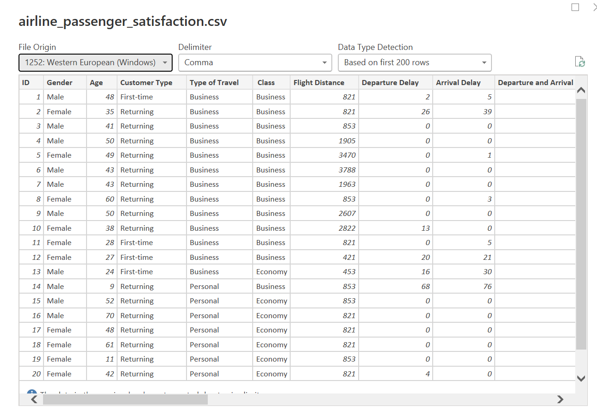
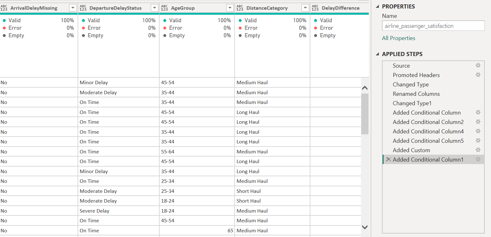
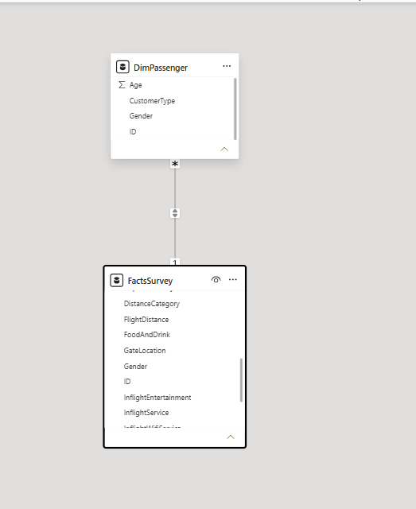
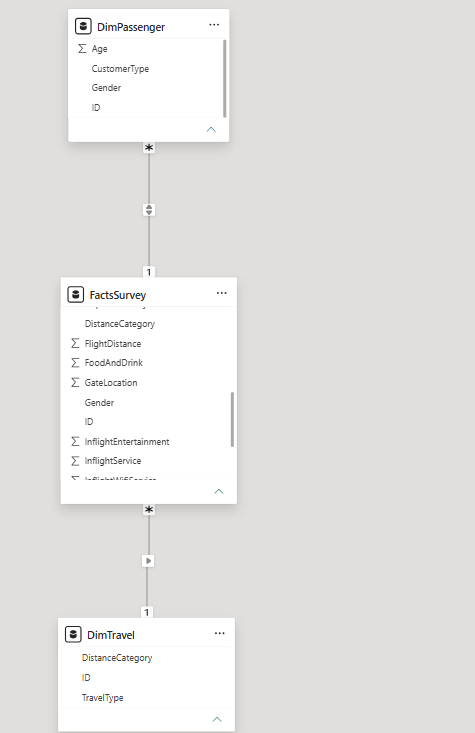
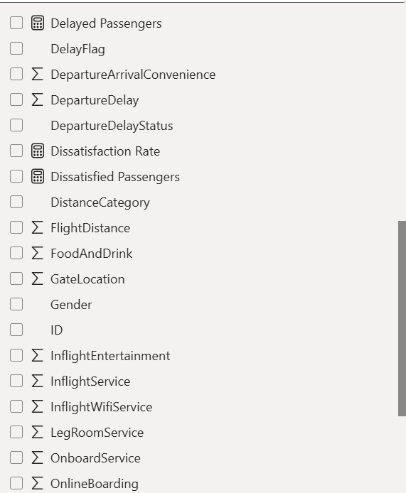
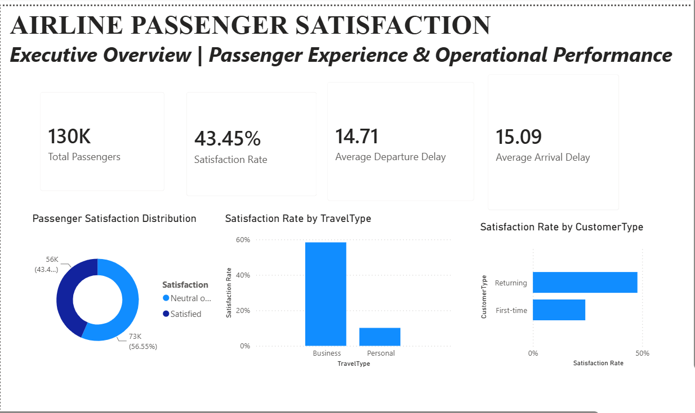
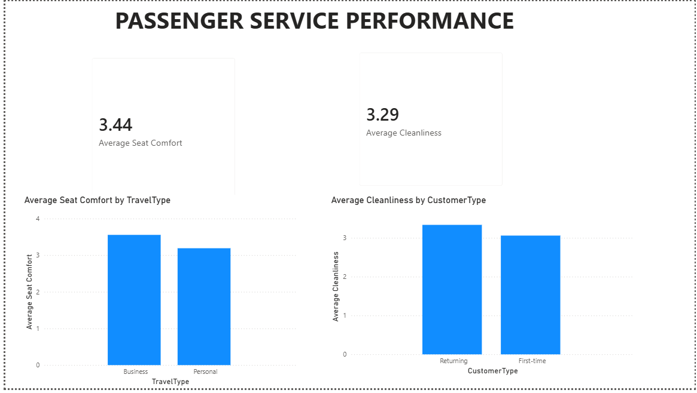
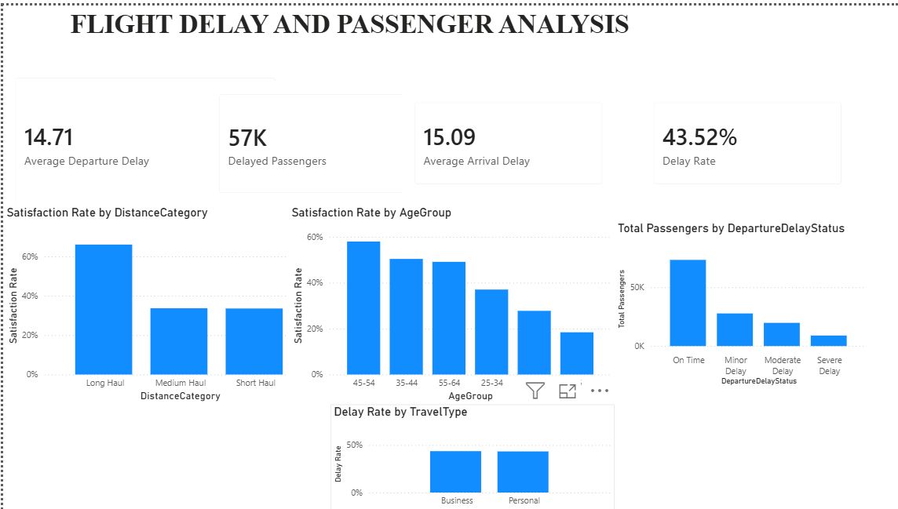

# Airline Passenger Satisfaction Dashboard

## Project Overview

This project develops an interactive Power BI dashboard to analyse
airline passenger satisfaction, passenger experience and operational
performance.

The project covers dataset understanding, Power Query transformation,
data modelling, DAX analysis and interactive dashboard development.

---

# A. Dataset Selection & Understanding

## Dataset

The project uses the Airline Passenger Satisfaction dataset.

The dataset contains passenger-level survey information covering
demographic characteristics, travel information, flight distance,
departure and arrival delays, service experience ratings and overall
passenger satisfaction.

## Why This Dataset Was Selected

The dataset was selected because it provides a sufficiently large
collection of passenger records and includes both categorical and
numerical variables suitable for business intelligence analysis.

The combination of passenger characteristics, travel information,
delay information and service ratings allows passenger satisfaction
to be analysed from multiple perspectives.

## Business Problem

Airline passenger satisfaction can be affected by different aspects
of the passenger experience, including service quality, convenience,
comfort and flight delays.

The purpose of this project is to analyse these factors and identify
patterns in passenger satisfaction that can support better operational
and customer-experience decisions.

## Analytical Questions

1. What proportion of passengers are satisfied and dissatisfied?
2. How does satisfaction vary by travel type?
3. How does satisfaction differ between customer types?
4. How does satisfaction vary across different age groups?
5. How do service experience ratings compare across passenger groups?
6. What is the average departure and arrival delay?
7. How does satisfaction vary by flight distance?
8. What patterns exist between delays and passenger satisfaction?

---

# B. Power Query Transformations

## 1. Standardize Column Names

Column names were standardized to make them easier to reference in
Power BI and DAX formulas.

## 2. Correct Data Types

Column data types were reviewed and corrected to ensure numerical,
categorical and other fields could be analysed appropriately.

## 3. ArrivalDelayMissing

Created `ArrivalDelayMissing` to identify records where arrival-delay
information was missing.

This helps distinguish missing values from actual delay values.

## 4. DepartureDelayStatus

Created `DepartureDelayStatus` to categorize passengers according to
their departure-delay status.

This allows delay patterns to be analysed using categories rather
than only raw numerical values.

## 5. AgeGroup

Created `AgeGroup` to group passengers into age categories.

This makes demographic comparisons easier in dashboard visuals.

## 6. DistanceCategory

Created `DistanceCategory` to group passengers according to flight
distance.

This allows satisfaction patterns to be compared across different
flight-distance segments.

## 7. DelayDifference

Created `DelayDifference` by comparing arrival delay with departure
delay.

This provides an additional indicator of how the delay changed between
departure and arrival.

## 8. DelayFlag

Created `DelayFlag` to classify records as delayed or not delayed
based on departure delay.

This supports simple KPI calculations such as the number and rate of
delayed passengers.

---

# C. Data Model

The Power BI model was developed to support analytical reporting and
separate passenger-related information from the main survey data.

The main analytical table is `FactSurvey`.

A passenger dimension was also created to support passenger-level
analysis.

The model was designed to support filtering and aggregation of the
survey records.

### Model Evidence

---

# D. DAX Measures

The dashboard uses DAX measures to calculate key performance indicators
and analytical metrics.

The measures created include:

- Total Passengers
- Satisfied Passengers
- Dissatisfied Passengers
- Satisfaction Rate
- Dissatisfaction Rate
- Average Age
- Average Flight Distance
- Average Departure Delay
- Average Arrival Delay
- Average Seat Comfort
- Average Cleanliness
- Delayed Passengers
- Delay Rate

DAX functions used include:

- `COUNTROWS`
- `CALCULATE`
- `AVERAGE`
- `DIVIDE`

### DAX Evidence

---

# E. Dashboard Design

The Power BI report contains three analytical pages.

## 1. Executive Overview

The Executive Overview provides a high-level summary of passenger
satisfaction and operational performance.

It includes:

- Total passengers
- Satisfaction rate
- Dissatisfaction rate
- Average departure delay
- Average arrival delay
- Passenger satisfaction distribution
- Satisfaction by travel type
- Satisfaction by customer type

---

## 2. Service Performance

The Service Performance page analyses selected aspects of the passenger
service experience.

It includes:

- Average seat comfort
- Average cleanliness
- Seat comfort by travel type
- Cleanliness by customer type

---

## 3. Delay Diagnostics

The Delay Diagnostics page focuses on flight delays and passenger
segments.

It includes:

- Average departure delay
- Average arrival delay
- Delayed passengers
- Delay rate
- Passenger distribution by departure-delay severity
- Satisfaction by age group
- Satisfaction by flight distance
- Delay rate by travel type

---

# F. Key Business Insights

The dashboard is designed to help identify:

- Overall passenger satisfaction levels
- Differences in satisfaction across passenger segments
- Service areas that perform better or worse
- Patterns in departure and arrival delays
- Satisfaction patterns across flight-distance categories
- Differences in delay rates across travel types

# Technologies Used
Microsoft Power BI
Power Query
DAX
GitHub
CSV dataset

---
